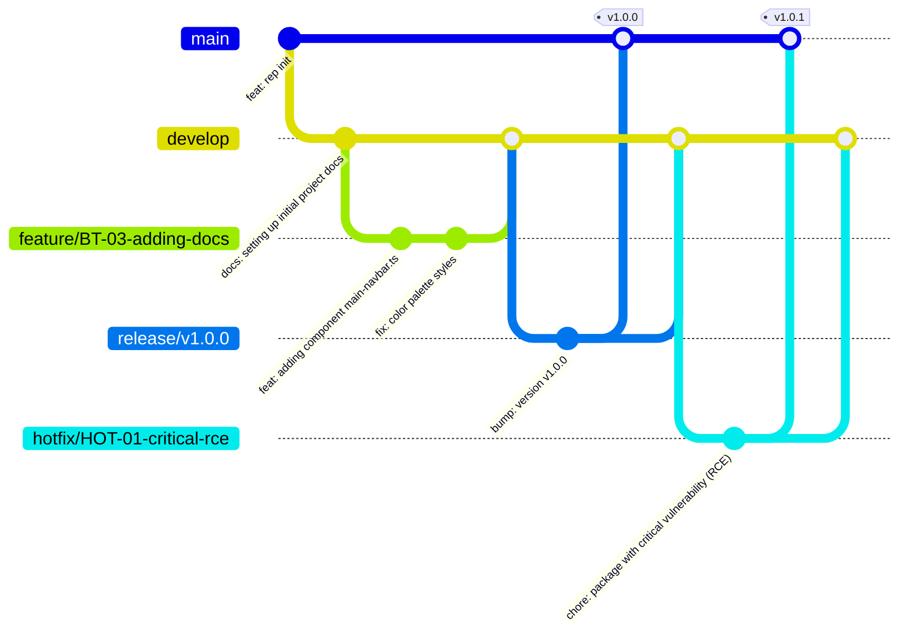

# Version Control

This document explains the Git Flow branching strategy used in this project.

## Git Flow Branching Strategy

I'm following the "Git Flow" pattern to manage the development process.

## Branches

### Main
The `main` branch contains the official release history. All code in `main` is ready for production environment.

### Develop
The `develop` branch serves as an integration branch for features. Once code is stable and ready for release, it is merged into `main` via a release branch.

### Feature Branches
Feature branches (`feature/*`) are used to develop new features. They should be created from `develop` and be merged back into `develop`.

### Release Branches
Release branches (`release/*`) support preparation of a new production release. They allow for minor bug fixes and preparing meta-data for a release. They should be created from `develop` and merged into both `main` and `develop`.

### Hotfix Branches
Hotfix branches (`hotfix/*`) are used to quick patches for production releases. They should be created from `main` and merged into both `main` and `develop` (or `release` if one is active).
